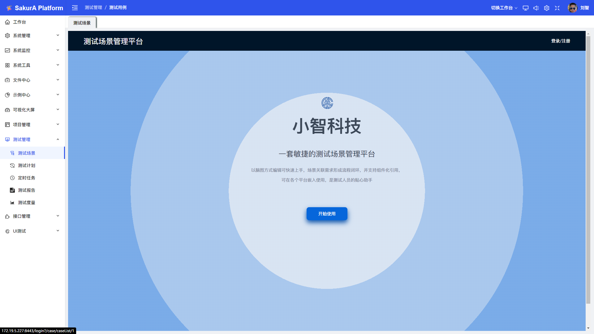
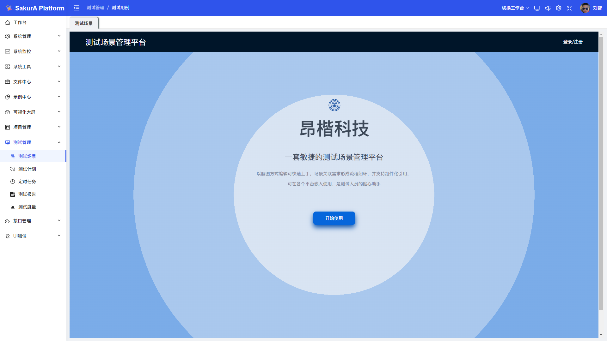
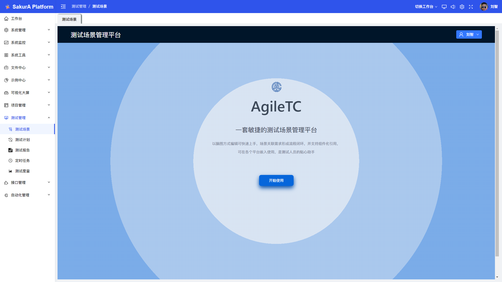
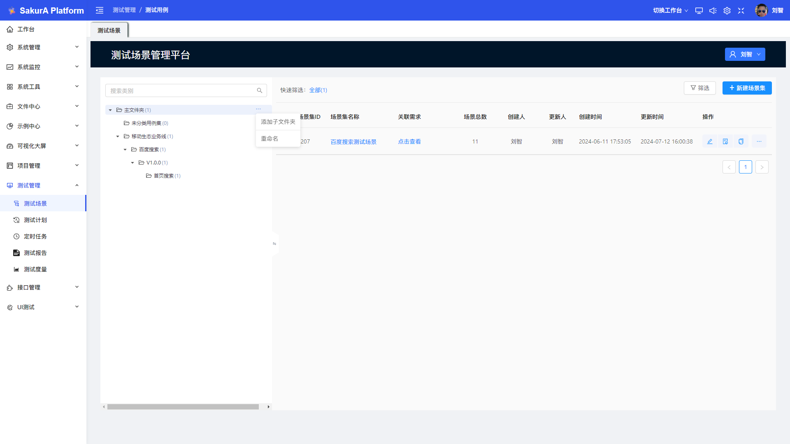
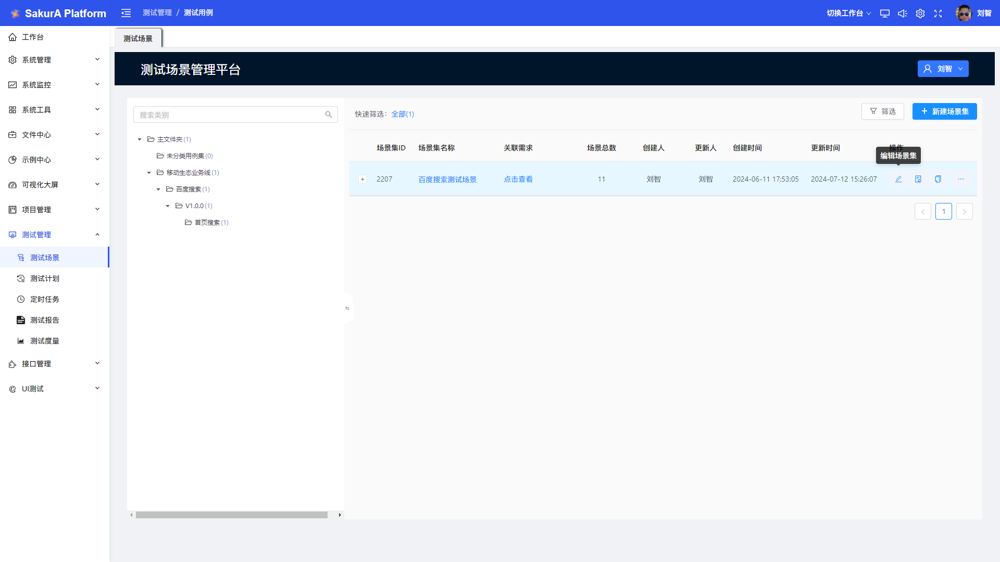
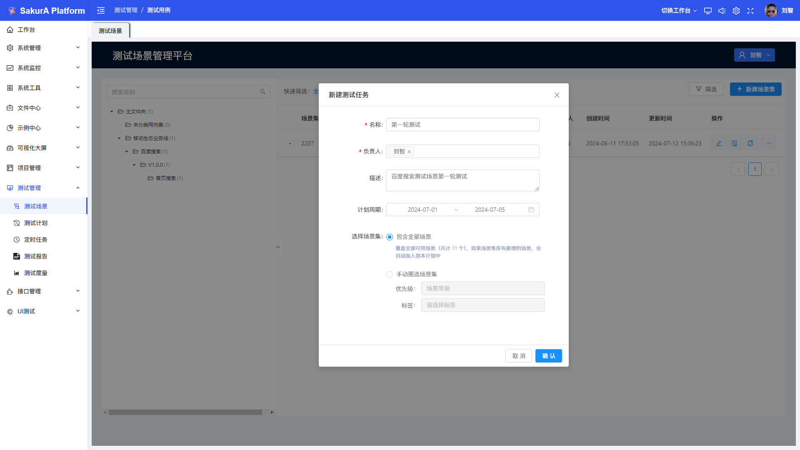
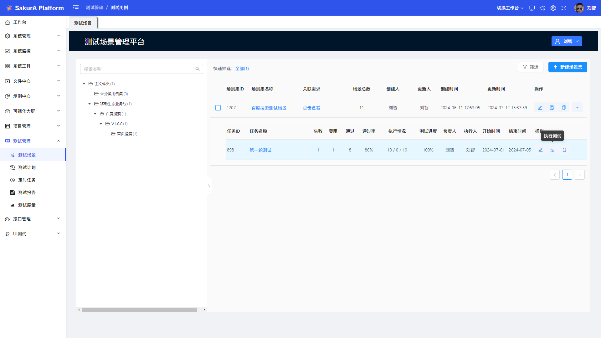
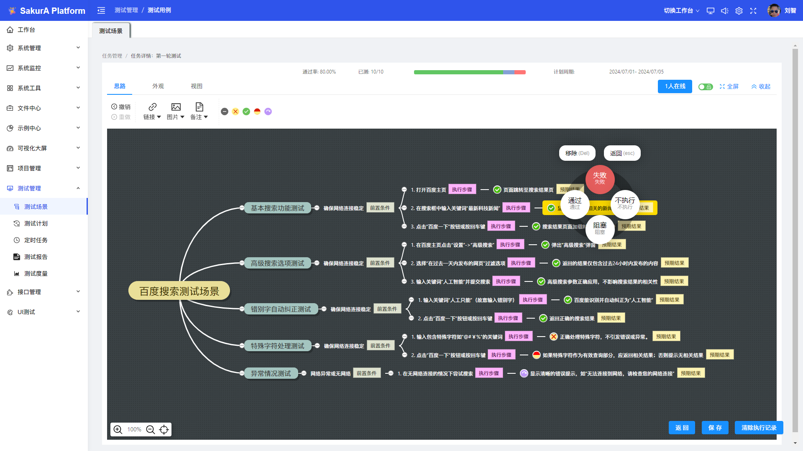
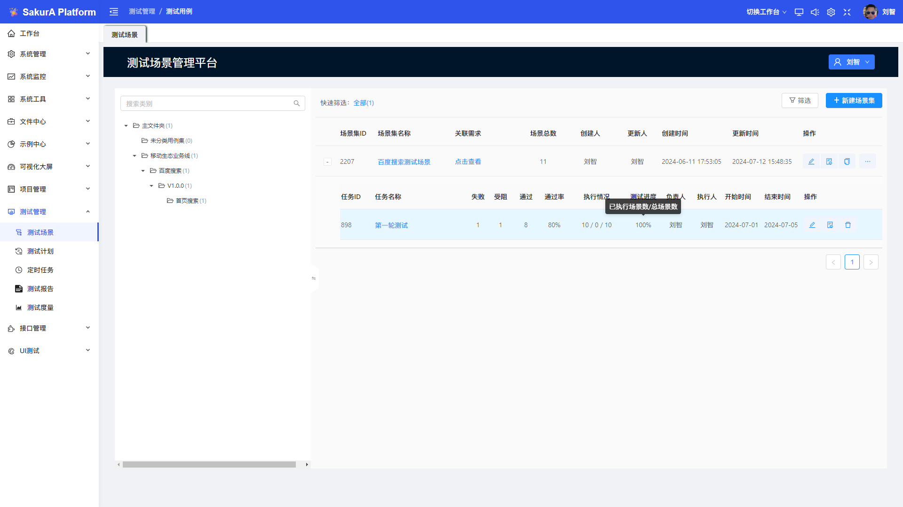

# 测试场景

<!--  -->
<!--  -->

## 注册登录

- 适用角色：所有人员
- 操作步骤：进入【测试管理】，点击【测试场景-开始使用-注册】，填写对应用户信息，点击【注册并登录】
  
:::tip

- 注意事项：用户名为中文账号，用自己的姓名即可

:::
<!--  -->
<!--  -->

## 新建场景目录

- 适用角色：所有人员
- 操作步骤：进入【测试场景管理平台】，点击左侧目录【添加子文件夹】，添加对应测试场景目录结构，即可
  
:::tip

- 请根据业务线-项目名称-版本号-模块名称-功能名称等结构，创建对应场景目录，例如：
  - 移动生态业务线
    - 百度搜索
      - V1.0.0
        - 首页搜索

:::

## 新建场景集

- 适用角色：所有人员
- 操作步骤：进入【测试场景管理平台】，点击右上角【新建场景集】，填写对应信息，点击【确认】

:::tip

- 场景集名称：填写测试场景集名称，例如：百度搜索测试场景
- 关联需求：填写关联需求链接地址，例如：https://www.baidu.com
- 场景集分类：选择测试场景集分类，例如：首页搜索
- 描述：填写测试场景集描述，例如：百度搜索测试场景
- 导入本地xmind：手动导入本地Xmind文件（非必传），例如：D://xxx.xmind

:::

## 编辑测试场景

- 适用角色：所有人员
- 操作步骤：进入【测试场景管理平台】，选择测试场景，点击【编辑场景集合】，即可进入Xmind编辑页面

:::tip

- 根据场景法，按照以下格式，编写测试场景，例如：
  - 场景名称：
    - 基本搜索功能测试
  - 前置条件：
    - 确保网络连接稳定
  - 执行步骤：
    - 步骤1：打开百度搜索
    - 步骤2：在搜索框中输入关键词“最新科技新闻”
    - 步骤3：点击“百度一下”按钮或按回车键
  - 预期结果：
    - 结果1：页面跳转至搜索结果页
    - 结果2：显示与关键词相关的新闻列表
    - 结果3：搜索结果页面加载时间不超过3秒

:::

## 新建测试任务

- 适用角色：所有人员
- 操作步骤：进入【测试场景管理平台】，选择测试场景，点击【创建测试任务】，填写对应信息，点击【确认】

:::tip

- 名称：填写测试任务名称，例如：第一轮测试
- 负责人：选择对应测试任务负责人，例如：刘智
- 描述：填写测试任务描述，例如：百度搜索测试场景第一轮测试
- 计划周期：选择测试场任务计划周期，例如：2024-07-01至2024-07-05
- 选择场景集：分为包含全部场景和手动圈选场景集，例如：
  - 包含全部场景：可覆盖全部可用场景进行测试
  - 手动圈选场景集：可根据优先级和标签选择对应可用场景进行测试

:::

## 执行测试任务

- 适用角色：所有人员
- 操作步骤：进入【测试场景管理平台】，选择测试场景，点击【执行测试】，即可进入执行测试页面

:::tip

- 根据实际测试情况，标记对应测试场景用例执行结果，如下：
  - 通过：可标记该条测试用例为通过
  - 失败：可标记该条测试用例为失败
  - 阻塞：可标记该条测试用例为阻塞
  - 不执行：可标记该条测试用例为不执行

:::

## 查看测试情况

- 适用角色：所有人员
- 操作步骤：进入【测试场景管理平台】，选择测试场景，查看测试执行情况

:::tip

- 根据实际测试情况，可查看对应测试场景用例执行情况，如下：
  - 失败：统计测试场景用例失败个数
  - 阻塞：统计测试场景用例阻塞个数
  - 通过：统计测试场景用例通过个数
  - 通过率：计算测试场景用例通过率（通过场景数/已执行场景数*100%）
  - 执行情况：统计测试场景用例执行情况，(已执行个数/未执行个数/总场景数个数)
  - 测试进度：计算测试场景用例执行进度（已执行场景数/总场景数*100%）

:::
