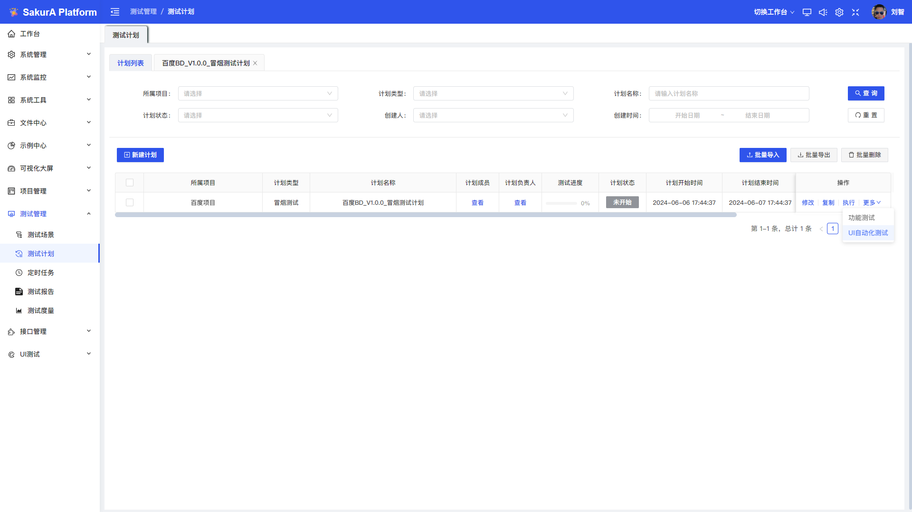
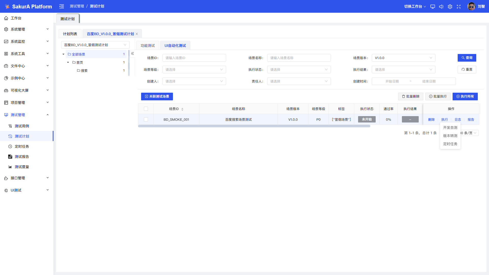
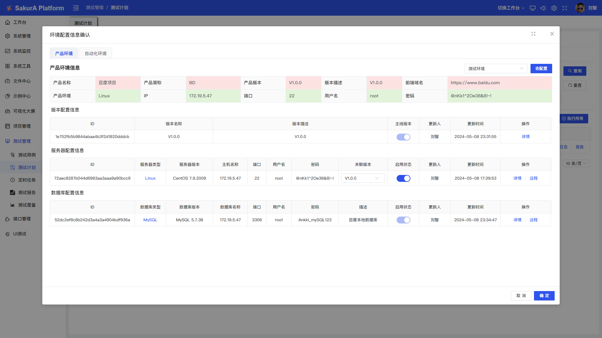
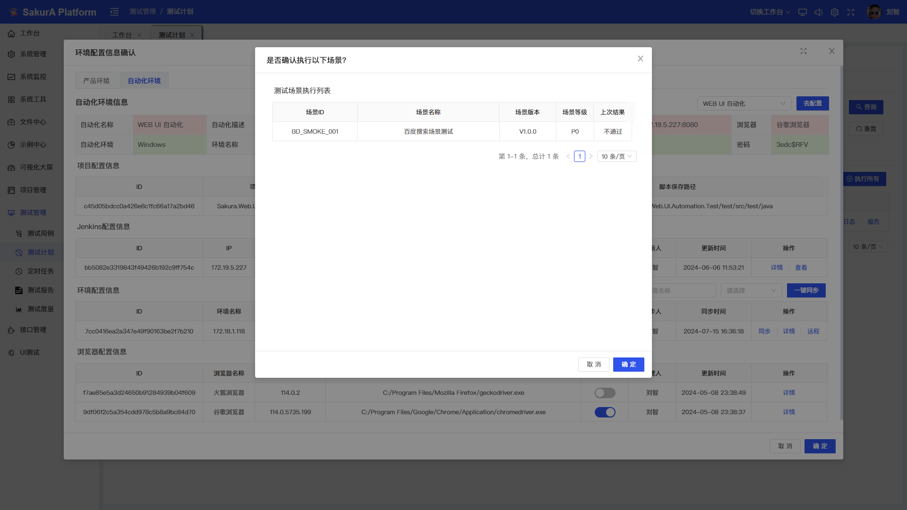
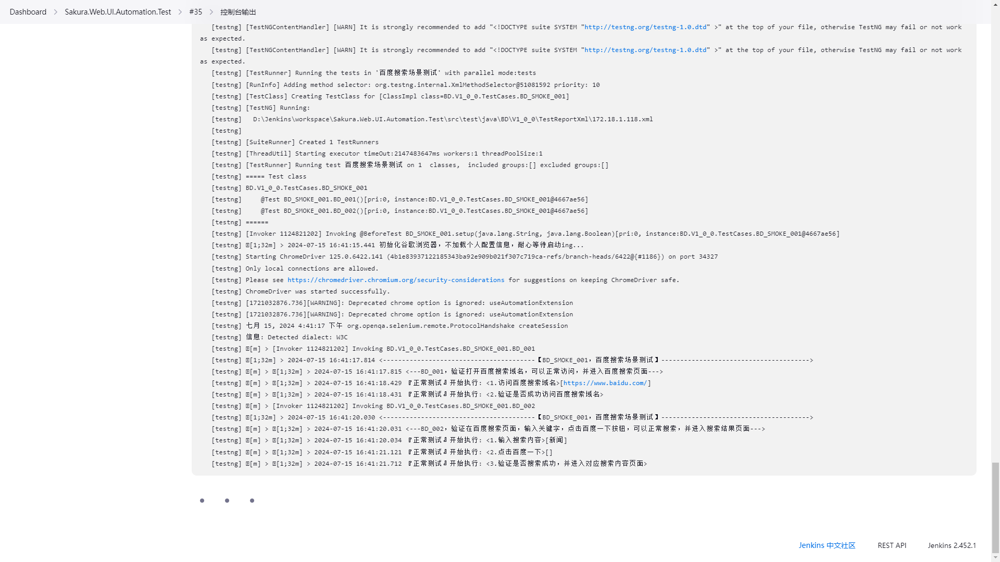
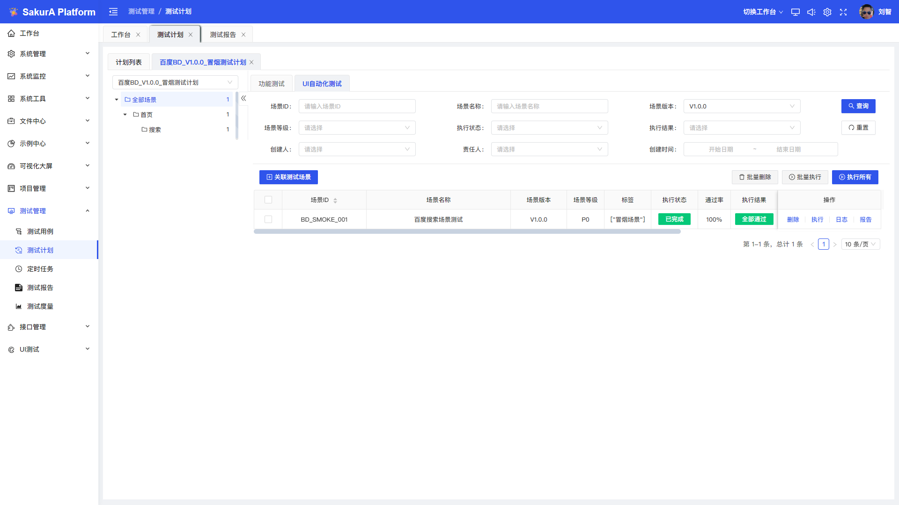
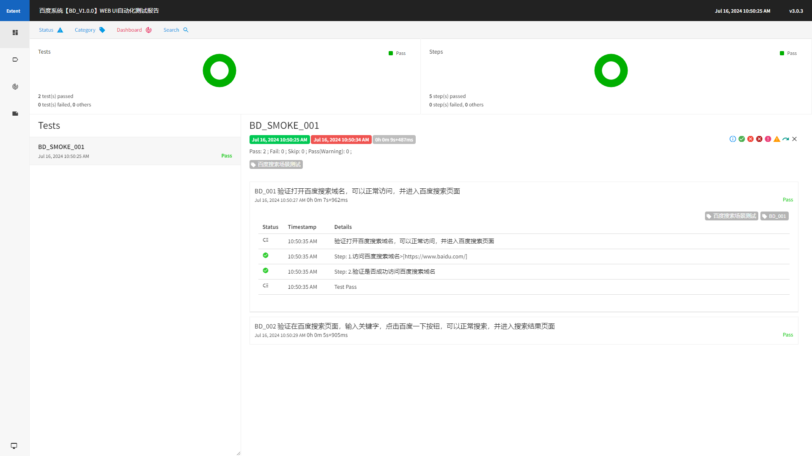

# 测试计划

## 新建测试计划

- 适用角色：所有人员
- 操作步骤：进入【测试管理-测试计划】，点击【新建计划】，填写对应计划信息，点击【立即创建】
  
:::tip

- 所属项目：选择计划所属项目，例如：百度项目
- 计划类型：选择对应计划类型，例如：冒烟测试
- 计划名称：填写对应计划名称，例如：百度BD_V1.0.0_冒烟测试计划
- 计划简称：填写对应计划简称，例如：BD_V1.0.0_MY
- 计划描述：填写对应计划描述，例如：百度BD_V1.0.0_冒烟测试计划
- 计划成员：选择对应计划成员，例如：刘智，XXX
- 主负责人：填写对应主负责人，例如：刘智
- 计划时间：选择对应计划时间，例如：2024-07-01至2024-07-05
- 计划状态：选择对应计划状态，例如：默认未开始

:::

## 执行测试计划

### UI自动化测试

- 适用角色：所有人员
- 操作步骤：进入【测试管理-测试计划】，选择测试计划，点击【执行-UI自动化测试】，即可进入执行页面

#### 关联测试场景

:::tip

- 执行UI自动化测试，需要关联测试场景，关联的测试场景为UI自动化中调试通过的场景，如下：
  - 点击【执行】，选择【UI自动化测试】，进入UI自动化测试执行页面
  - 点击【关联测试场景】，进入关联测试场景页面
  - 点击【关联所有】，可根据搜索条件，一键批量关联
  - 勾选对应测试场景，点击【确定】，即可成功关联

:::

#### 执行测试场景

> 选择执行类型
:::tip

- 执行UI自动化测试场景分为开发自测，版本转测，定时任务等方式，可单个，批量，全部执行，如下：
  - 开发自测：选择开发自测，则生成的报告执行类型会标识为开发自测
  - 版本转测：选择版本转测，则生成的报告执行类型会标识为版本转测
  - 定时任务：选择定时任务，则生成的报告执行类型会标识为定时任务
  
:::

> 确认环境配置信息
:::tip

- 执行UI自动化测试，需要确认环境配置信息，根据选择的环境配置信息对应展示，如下：
  - 产品环境配置：
    - 产品名称：对应项目配置中的项目名称，例如：百度项目
    - 产品简称：对应项目配置中的项目简称，例如：BD
    - 产品版本：对应环境配置-版本配置中的版本名称，例如：V1.0.0
    - 版本描述：对应环境配置-版本配置中的版本描述，例如：V1.0.0
    - 前端域名：对应环境配置-服务器配置-参数配置中的前端域名，例如：https://www.baidu.com
    - 产品环境：对应环境配置-服务器配置中的服务器类型，例如：Linux
    - IP：对应环境配置-服务器配置中的主机名称，例如：172.19.5.47
    - 端口：对应环境配置-服务器配置中的主机端口，例如：22
    - 用户名：对应环境配置-服务器配置中的用户名，例如：root
    - 密码：对应环境配置-服务器配置中的密码，例如：@nKk1^2Oe38&8!~!
  
:::

:::tip

- 自动化环境配置：
  - 自动化名称：对应自动化配置中的配置名称，例如：WEB UI 自动化
    - 自动化描述：对应自动化配置中的配置描述，例如：WEB UI 自动化测试配置
    - 自动化项目：对应自动化配置-项目配置中的项目名称，例如：Sakura.Web.UI.Automation.Test
    - Jenkins：对应自动化配置-Jenkins配置中地址，例如：http://172.19.5.227:8080
    - 浏览器：对应自动化配置-浏览器配置中浏览器名称，例如：谷歌浏览器
  - 自动化环境：对应自动化配置-环境配置中环境类型，例如：Windows
    - 环境名称：对应自动化配置-环境配置中环境名称，例如：刘智
    - IP：对应自动化配置-环境配置中环境名称，例如：172.18.1.118
    - 用户名：对应自动化配置-环境配置中用户名，例如：liuzhi
    - 密码：对应自动化配置-环境配置中密码，例如：3edc$RFV

:::

> 确认执行场景信息
:::tip

- 确认环境配置信息后，需要再次确认执行的场景信息，点击【确定】进入确认执行场景信息弹窗页面

:::

> 查看Jenkns执行日志
:::tip

- 确认好执行场景信息，点击【确定】等待10秒后，会自动进入Jenkins执行页面，并输出运行日志信息

:::

#### 查看测试结果

> 同步测试结果
:::tip

- 等待测试场景执行完毕后，会自动同步最新的测试结果，包含执行状态，通过率，执行结果，运行耗时

:::

> 查看邮件测试报告
:::tip

- 等待Jenkins执行完毕后，会自动发送相关测试报告到当前用户配置的邮箱地址中，详情可查看邮件

:::

> 查看在线测试日志
:::tip

- 等待测试场景执行完毕后，点击【操作-日志】，即可查看在线测试日志，如下：

:::

> 查看在线测试报告
:::tip

- 等待测试场景执行完毕后，点击【操作-报告】，即可查看在线测试报告，如下：

:::

