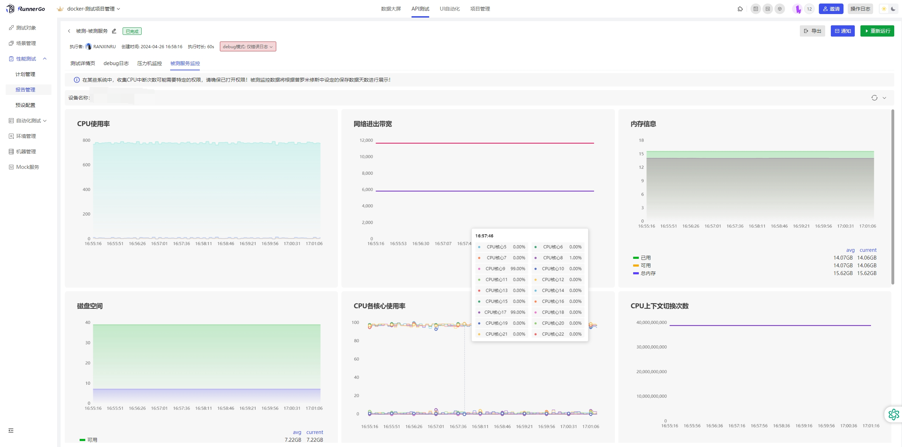

# 接口测试

## RunnerGo

- 适用角色：所有人员
- 操作步骤：进入【接口管理-接口测试】，即可使用【RunnerGo】进行接口测试
- 注意事项：RunnerGo需要使用本地部署的环境，在线暂不支持
- 帮助文档：https://wiki.runnergo.cn/docs

:::tip

- 地址：http://172.19.5.227:9998 （地址中的IP请改为你的服务器IP）
- 账号：runnergo（这是默认管理员账号，可自行注册）
- 密码：runnergo（这是默认管理员密码，可自行注册）

:::

