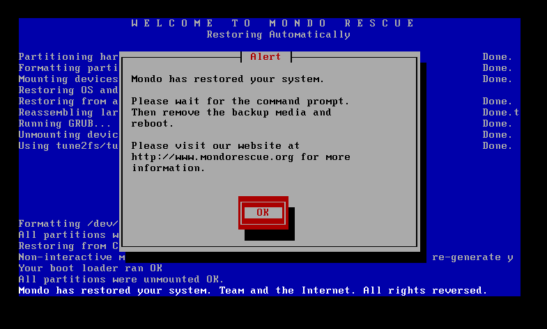
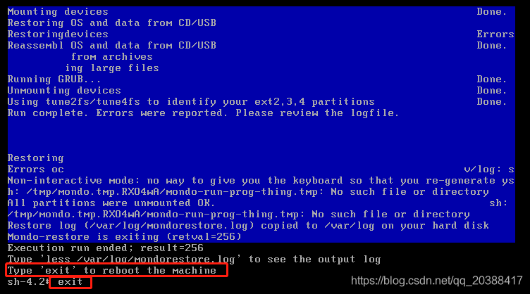
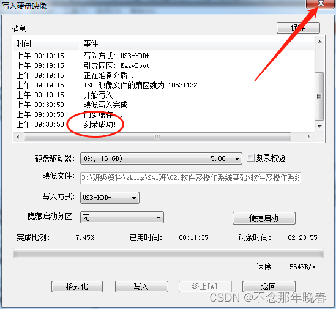

# 快速开始

## 环境准备

### 服务器要求

准备一台服务器（虚拟机，实体机，阿里云，腾讯云，华为云）都可以，要求如下：

:::tip
公司部署使用，推荐内部虚拟机或实体机服务器，可以通过内网访问，速度相对较快，一般没有带宽限制

个人部署使用，推荐本地虚拟机或在线云服务器，可以通过外网访问，速度相对较慢，一般会有带宽限制
:::

- CPU：4核或8核（推荐 8核）
- 内存：8G或16G（推荐 16G）
- 硬盘：200G或400G（推荐系统盘200G + 数据盘200G）
- 网络：可访问互联网

### ISO 镜像制作

当前使用Mondo Rescue进行Linux系统ISO文件镜像制作，可进行备份和还原。

- 官方地址：[点击访问](http://www.mondorescue.org/)
- 使用教程：[点击访问](https://www.cnblogs.com/safe-rabbit/p/17550182.html)


### ISO 镜像下载

下载地址： [点击下载，如失效，请联系作者](https://www.alipan.com/s/HH9CMavxNnw/folder/66cd7ae876ac4fb2fbeb440a95f4c7784ebea457)

:::tip

当前镜像文件已经上传至阿里云盘，压缩为.png格式文件，恢复后方可使用，操作如下：

- 下载恢复程序：【zipShare_x64.exe】
- 下载镜像文件：【Sakura.Automation.Platform_V1.0.0_CentOS-7.6_x86_64.iso.png】
- 恢复安装镜像：
  - 启动【zipShare_x64.exe】
  - 拖入【Sakura.Automation.Platform_V1.0.0_CentOS-7.6_x86_64.iso.png】到窗口即可

:::


## 虚拟机部署

### 安装教程

推荐使用VMware Workstation，下载最新版本，采用默认设置安装即可。

- 官方地址：[点击访问](https://www.vmware.com/products/workstation-pro/workstation-pro-evaluation.html)
- 官方教程：[点击访问](https://www.vmware.com/support/ws55/doc/ws_new_install.html)

### 创建虚拟机

- 启动虚拟机，创建新的虚拟机
- 
- 采用镜像安装方式，选择下载ISO镜像文件

- 选择Linux客户端操作系统和版本

- 指定虚拟机名称和安装位置

- 设置磁盘容量大小

- 完成创建

- 修改内存和CPU配置


### 启动虚拟机

- 完成创建虚拟机后，启动该虚拟机，输入【nuke】恢复系统

- 自动恢复中，等待恢复完成

- 恢复完成后，选择ok

- 输入exit，退出自动重启系统

- 重启系统后，选择第二个启动项进入系统，使用默认账号和密码登录

:::tip

- 账号：root
  
- 密码：3edc$RFV
  
:::


## 实体机部署

### 软件下载

推荐使用UltraISO，下载最新版本，采用默认设置安装即可。

- 官方地址：[点击访问](https://cn.ultraiso.net/xiazai.html)
- 官方教程：[点击访问](https://cn.ultraiso.net/jiaochengzhongxin.html)

### U盘启动

- 双击打开UltraISO，点击文件->打开->选择下载好的ISO文件->打开。

- 点击启动->写入硬盘映像。(写入方式建议使用USB-HDD+，隐藏启动分区选 无)。

- 选择对应U盘，进行格式化，点击开始

- 点击开始，弹出数据将格式化警告，确定后开始写入

- 点击写入，选择是，耐心等待写入完成，制作成功！


- 把U盘插到服务器，设置开机U盘启动，输入nuke，回车。

- 自动恢复中，等待恢复完成

- 恢复完成后，选择ok

- 输入exit，退出自动重启系统

- 重启系统后，选择第二个启动项进入系统，使用默认账号和密码登录

:::tip

- 账号：root
  
- 密码：3edc$RFV
  
:::


## 修改IP地址

进入系统后，修改IP地址，然后重启网络。
:::tip
修改前请先ping一下IP地址，确保该IP地址可用，且未被其他人使用，不然会IP冲突。
:::

```bash
# 查看网络信息
ip a
# 修改网卡配置文件名称为对应网卡名称
cd /etc/sysconfig/network-scripts/
mv ifcfg-ens192 ifcfg-ens33 #这里的网卡名称为ens33，请根据实际情况修改
# 修改IP地址
vi ifcfg-ens33
# 参考以下配置
TYPE=Ethernet
PROXY_METHOD=none
BROWSER_ONLY=no #默认是yes，修改为no
BOOTPROTO=static # 默认是dhcp，修改为static
DEFROUTE=yes
IPV4_FAILURE_FATAL=yes # 默认是no，修改为yes
IPV6INIT=yes
IPV6_AUTOCONF=yes
IPV6_DEFROUTE=yes
IPV6_FAILURE_FATAL=no
IPV6_ADDR_GEN_MODE=stable-privacy
NAME=ens192 # 修改为自己的网卡名称，可通过【ip a】命令查看
UUID=6280f4db-5773-4760-b83c-e5fc57cc086c
DEVICE=ens192 # 修改为自己的网卡名称，可通过【ip a】命令查看
ONBOOT=yes  # 默认是no，修改为yes
IPADDR=172.19.5.227 # 修改为你的IP地址，没有就新增
GATEWAY=172.19.5.1  # 修改为你的网关，没有就新增
NETMASK=255.255.255.0 # 修改为你的子网掩码，没有就新增
DNS1=114.114.114.114 # 修改为你的DNS，没有就新增
ZONE=public

# 重启网络
systemctl restart network
```

## 1Panel面板配置

:::tip

默认已经安装好1Panel环境，可直接使用，需修改相关IP地址，详情请进入1Panel面板查看

- 地址：http://172.19.5.227:28134/c0464ecc59 （地址中的IP请改为你的服务器IP）
- 账号：root
- 密码：3edc$RFV

:::

### 修改主机名

- 点击左侧工具箱菜单，修改主机名为自己的IP地址，例如172.19.5.227


### 修改服务器地址

- 点击左侧面板设置菜单，修改服务器为自己的IP地址，例如172.19.5.227


## Docker配置

:::tip

默认已经安装好1Panel面板并搭建好Docker环境，可直接使用，详情请进入1Panel容器面板查看

- 地址：http://172.19.5.227:28134/containers/container （地址中的IP请改为你的服务器IP）
- 账号：root
- 密码：3edc$RFV
- 路径：打开左侧容器菜单，点击顶部【配置】菜单，启动docker容器，如无法启动，请查看 [常见问题](/3.其它/1.常见问题/#Docker无法启动-)

:::


## Jenkins配置

:::tip

默认已经搭建好Jenkins环境，可直接使用，详情请进入1Panel容器面板查看

- 地址：http://172.19.5.227:28134/containers/container （地址中的IP请改为你的服务器IP）
- 账号：root
- 密码：3edc$RFV
- 路径：打开左侧容器菜单，点击顶部【容器】菜单，启动Jenkins容器，如无法启动，请查看 [常见问题](/3.其它/1.常见问题/#Docker无法启动-)

:::


### Jenkins URL修改

:::tip

- 访问：http://172.19.5.227:8080/manage/configure （地址中的IP请改为你的服务器IP）
- 账号：sakura
- 密码：3edc$RFV
- 路径：【系统管理】-【系统配置】，修改 Jenkins URL为 自己的IP地址，点击保存

:::


:::tip

- 访问：http://172.19.5.227:8080/view/自动化测试平台/ （地址中的IP请改为你的服务器IP）
- 账号：sakura
- 密码：3edc$RFV

:::

### 前端项目部署

- 点击顶部自动化测试平台标签，选择【Sakura.Automation.Platform.Web.Deploy】项目
- 点击左侧【Build with Parameters】，【服务器IP】填写自己的，【发布版本】默认，【分支版本】选择【test】
- 点击【Build】进行构建，构建失败则重新构建，等待构建成功


### 后端项目部署

- 点击顶部自动化测试平台标签，选择【Sakura.Automation.Platform.Api.Deploy】项目
- 点击左侧【Build with Parameters】，【发布版本】默认，【分支版本】选择【test】
- 点击【Build】进行构建，构建失败则重新构建，等待构建成功


### 测试场景项目部署

- 点击顶部自动化测试平台标签，选择【Sakura.TestCase.Platform.Deploy】项目
- 点击左侧【Build with Parameters】，【发布版本】默认，【分支版本】选择【test】
- 点击【Build】进行构建，构建失败则重新构建，等待构建成功


## 网站配置

:::tip

默认已经安装好1Panel面板并创建好前端访问站点，可直接使用，详情请进入1Panel网站面板查看

- 地址：http://172.19.5.227:28134/websites （地址中的IP请改为你的服务器IP）
- 账号：root
- 密码：3edc$RFV
- 路径：打开左侧网站菜单，选择172.19.5.227:8083
  - 点击【其他】，修改主域名为【172.19.5.227:8083】（地址中的IP请改为你的服务器IP）
  - 点击【配置文件】，修改内容参考如下，点击保存并重载

:::

```bash
# 参考以下配置
server {
    listen 8083 ; 
    server_name 172.19.5.227; # 这里修改为你自己的IP地址
    index index.php index.html index.htm default.php default.htm default.html; 
    try_files $uri $uri/ /index.html; 
    proxy_set_header Host $host; 
    proxy_set_header X-Forwarded-For $proxy_add_x_forwarded_for; 
    proxy_set_header X-Forwarded-Host $server_name; 
    proxy_set_header X-Real-IP $remote_addr; 
    proxy_http_version 1.1; 
    proxy_set_header Upgrade $http_upgrade; 
    proxy_set_header Connection "upgrade"; 
    access_log /www/sites/sakura.automation.platform.web.prod/log/access.log; 
    error_log /www/sites/sakura.automation.platform.web.prod/log/error.log; 
    location ^~ /.well-known/acme-challenge {
        allow all; 
        root /usr/share/nginx/html; 
    }
    location /api {
        rewrite ^/api/(.*)$ /$1 break; 
        proxy_pass http://172.19.5.227:8084; # 这里修改为你自己的IP地址
        index index.html; 
    }
    root /www/sites/sakura.automation.platform.web.test/index/dist; 
}
```


## 访问域名

客户端通过浏览器访问以下地址，输入默认账号和密码，即可开始使用。
:::tip

- 地址: http://172.19.5.227:8083（地址中的IP请改为你的服务器IP）
- 账号：管理员
- 密码：111111
- 可自己注册账号使用

:::

