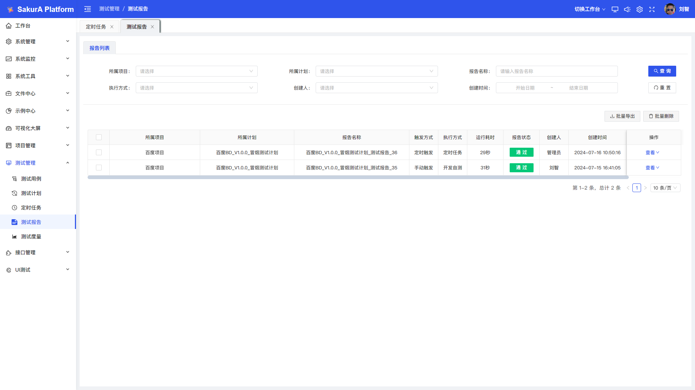

# 定时任务

## 创建定时任务

- 适用角色：所有人员
- 操作步骤：进入【测试管理-定时任务】，点击【新建任务】，填写对应任务信息，点击【立即创建】
- 操作描述：定时任务的主要作用指定时间执行对应测试计划，例如：每天凌晨3点执行XXXX_冒烟测试计划

:::tip

- 所属计划：选择任务所属计划，例如：百度BD_V1.0.0_冒烟测试计划
- 任务类型：选择对应任务类型，例如：UI自动化
- 任务名称：填写对应任务名称，例如：百度BD_V1.0.0_冒烟测试计划_定时任务
- 任务描述：填写对应任务描述，例如：百度BD_V1.0.0_冒烟测试计划_定时任务
- 运行环境：选择对应运行环境，例如：产品环境，自动化环境等
- 运行规则：填写对应运行规则，例如：0 0 3 * * ?（cron表达式）
- 是否并发：选择对应是否并发，例如：禁止
- 错误策略：选择对应错误策略，例如：立即执行
- 任务状态：选择对应任务状态，例如：默认开启

:::

## 查看执行日志

- 适用角色：所有人员
- 操作步骤：进入【测试管理-定时任务】，选择对应定时任务，点击【操作-日志】，即可查看

:::tip

- 定时任务列表数据来源是根据对应测试计划定时自动执行后生成的，列表展示信息如下：
  - ID：按定时任务执行顺序自增，例如：1、2、3
  - 所属计划：对应任务所属计划，例如：百度BD_V1.0.0_冒烟测试计划
  - 任务类型：对应定时任务类型，例如：UI自动化
  - 任务名称：对应定时任务名称，例如：百度BD_V1.0.0_冒烟测试计划_定时任务
  - 运行规则：对应任务运行规则，例如：0 0 3 * * ?（cron表达式）
  - 执行状态：对应定时任务状态，例如：成功
  - 执行时间：对应定时任务生成时间，例如：2024-07-15 16:41:05

:::

## 查看测试报告

- 适用角色：所有人员
- 操作步骤：进入【测试管理-测试报告】，即可查看

:::tip

- 注意事项：每次定时任务执行成功后，都会自动生成对应的测试报告

:::
