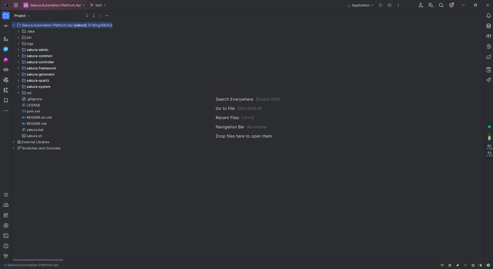
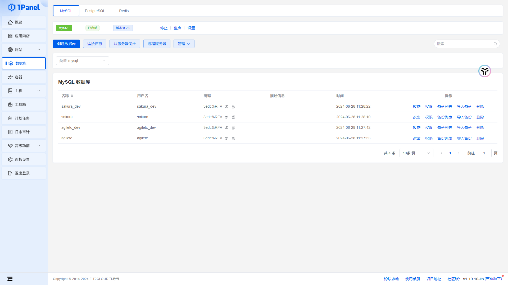
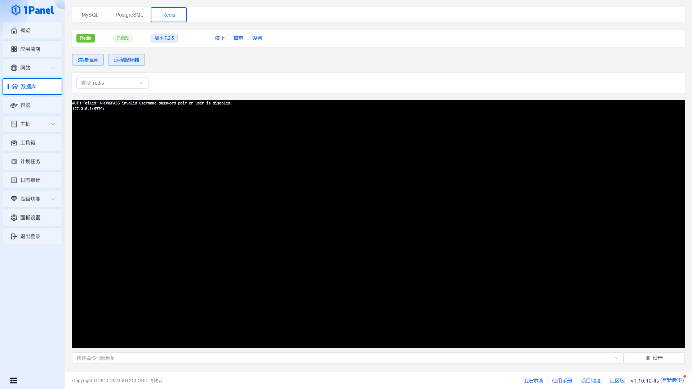
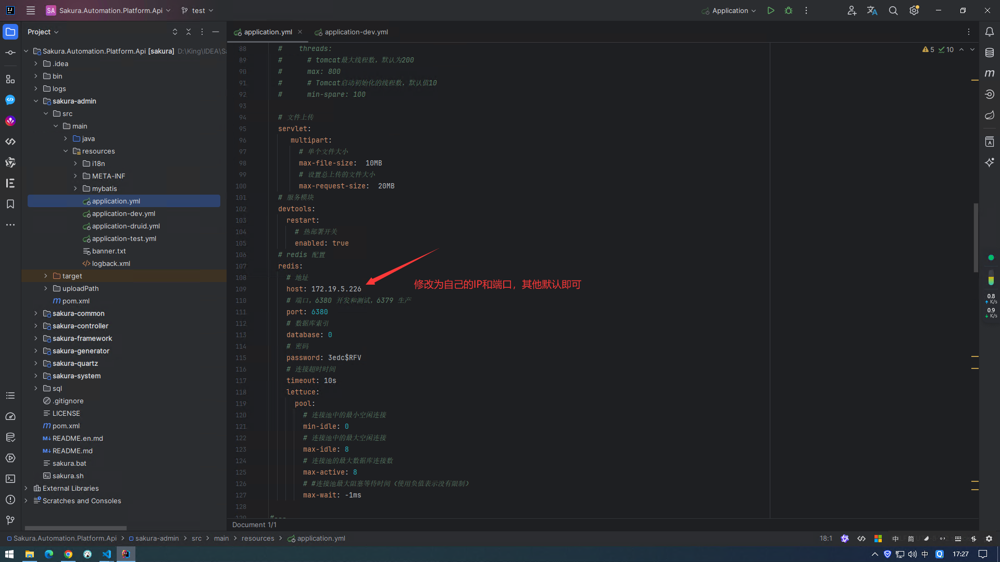
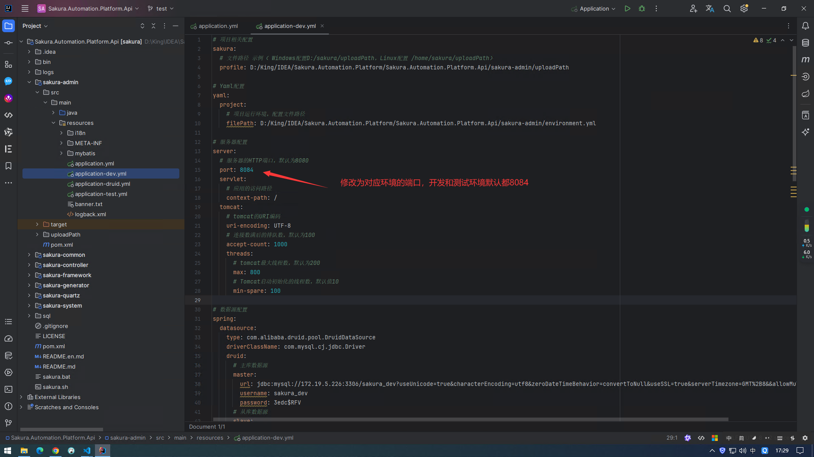
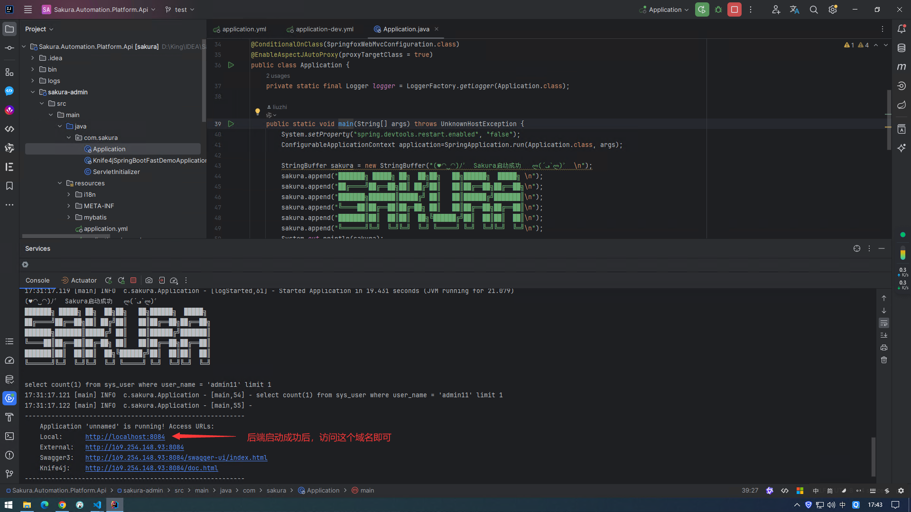
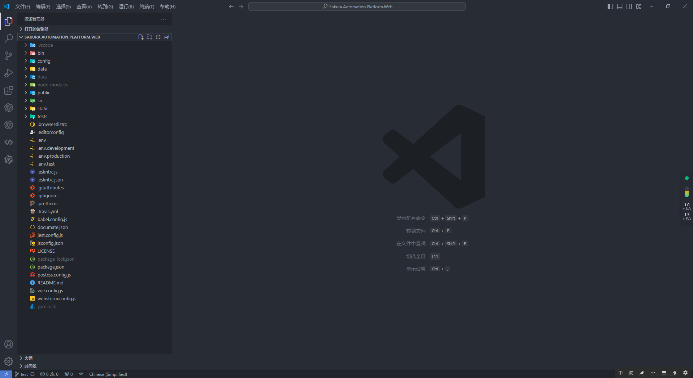
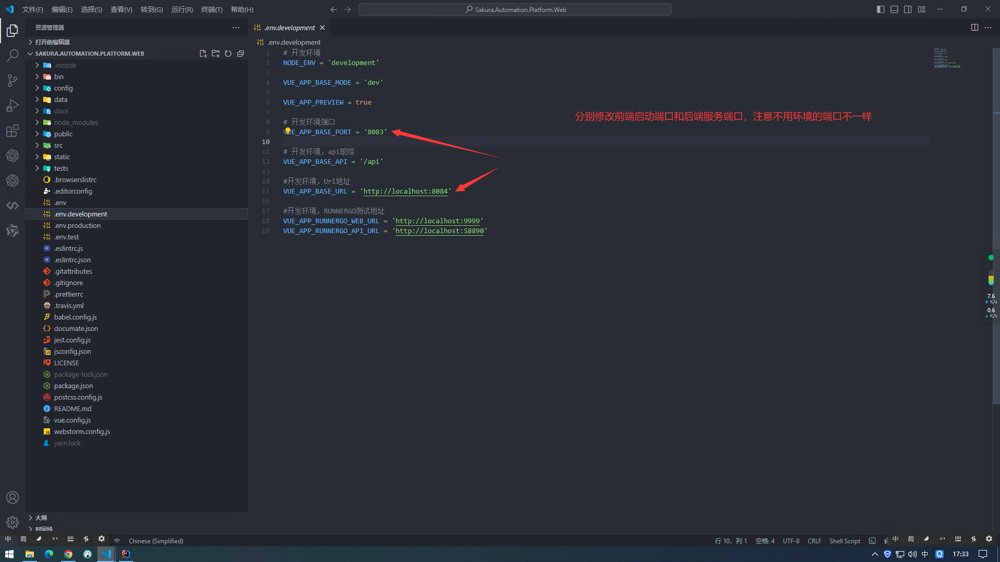

# 本地开发

## 环境搭建

:::tip

下载地址：https://share.weiyun.com/lFNsB9Ye

:::

- JDK = v1.8 (推荐v1.8版本)
- Ant >= v1.9.6 (推荐v1.9.6版本)
- Redis >= v7.0.5(推荐v7.0.5版本)
- Maven >= v3.3.9(推荐v3.3.9版本)
- Mysql >= v5.7.0 (推荐v5.7.0版本)
- Git >= v2.36.1 (推荐v2.36.1版本)
- Python = v3.9.0 (推荐v3.9.0版本)
- Node >= v16.16.0 (推荐v16.16.0版本)
- Eclipse/IDEA (推荐IDEA稳定版本)
- Microsoft VS Code (推荐VS Code稳定版本)
- Navicat (推荐稳定版本)

## 项目启动

### 后端启动

- 创建本地目录，例如：`D:\IDEA\Sakura.Automation.Platform`

- 进入项目目录，执行命令：

  ```bash
  cd D:\IDEA\Sakura.Automation.Platform
  git clone https://github.com/hagyao520/Sakura.Automation.Platform.Api.git
  或
  git clone https://gitee.com/SakuraTech/Sakura.Automation.Platform.Api.git
  ```

- 启动Eclipse或IDEA，导入或打开项目Sakura.Automation.Platform.Api

:::tip

- 使用Eclipse，菜单 File -> Import，然后选择 Maven -> Existing Maven Projects，点击 Next> 按钮，选择工作目录，然后点击 Finish 按钮，即可成功导入。
- 使用IDEA，菜单 File -> Open，选择工作目录，然后点击 OK 按钮，即可成功导入。
- 初次会自动加载Maven依赖包，加载会比较慢（根据自身网络情况而定）

:::


- 创建MySQL数据库，执行初始化SQL脚本

:::tip

1. 默认已经安装好1Panel面板并创建好MySQL数据库，可直接使用，详情请进入1Panel数据库管理面板查看

- 地址：http://172.19.5.227:28134/c0464ecc59 （地址中的IP请改为你的服务器IP）
- 账号：root
- 密码：3edc%RFV
- 路径：打开左侧数据库菜单，选择顶部MySQL选项

2. 默认有2个数据库，开发测试共用一个，生产单独用一个

> 开发&测试数据库

- 数据库名：sakura_dev
- 端口：3306
- 账号：sakura_dev
- 密码：3edc%RFV

> 生产数据库

- 数据库名：sakura
- 端口：3306
- 账号：sakura
- 密码：3edc%RFV
  
:::


- 修改`sakura-admin/src/main/resources/application-dev.yml`中master下url中的IP，其他默认即可

```yml
# 数据源配置
spring:
  datasource:
    type: com.alibaba.druid.pool.DruidDataSource
    driverClassName: com.mysql.cj.jdbc.Driver
    druid:
      # 主库数据源
      master:
        url: jdbc:mysql://172.19.5.227:3306/sakura_dev?useUnicode=true&characterEncoding=utf8&zeroDateTimeBehavior=convertToNull&useSSL=true&serverTimezone=GMT%2B8&&allowMultiQueries=true
        username: sakura_dev
        password: 3edc%RFV
      # 从库数据源
      slave:
        # 从数据源开关/默认关闭
        enabled: false
        url:
        username:
        password:
      # 初始连接数
      initialSize: 5
      # 最小连接池数量
      minIdle: 10
      # 最大连接池数量
      maxActive: 20
      # 配置获取连接等待超时的时间
      maxWait: 60000
      # 配置间隔多久才进行一次检测，检测需要关闭的空闲连接，单位是毫秒
      timeBetweenEvictionRunsMillis: 60000
      # 配置一个连接在池中最小生存的时间，单位是毫秒
      minEvictableIdleTimeMillis: 300000
      # 配置一个连接在池中最大生存的时间，单位是毫秒
      maxEvictableIdleTimeMillis: 900000
      # 配置检测连接是否有效
      validationQuery: SELECT 1 FROM DUAL
      testWhileIdle: true
      testOnBorrow: false
      testOnReturn: false
      webStatFilter:
        enabled: true
      statViewServlet:
        enabled: true
        # 设置白名单，不填则允许所有访问
        allow:
        url-pattern: /druid/*
        # 控制台管理用户名和密码
        login-username: sakura
        login-password: 123456
      filter:
        stat:
          enabled: true
          # 慢SQL记录
          log-slow-sql: true
          slow-sql-millis: 1000
          merge-sql: true
        wall:
          config:
            multi-statement-allow: true
 ```


- 创建Redis数据库

:::tip

1. 1Panel面板默认已经安装并创建好Redis数据库，可直接使用，详情请进入1Panel数据库管理面板查看

- 地址：http://172.19.5.227:28134/c0464ecc59 （地址中的IP请改为你的服务器IP）
- 账号：root
- 密码：3edc%RFV
- 路径：打开左侧数据库菜单，选择顶部Redis选项
  
<!-- 2. 默认端口为6379，如果需要同时使用多个Redis时，需要配置不同的端口启动，例如：6380，6381等

- 创建多个.conf, 例如：redis6380.conf
- 修改redis6380.conf中的端口为6380
- 启动redis6380.conf，执行以下命令
  
```bash
redis-server /www/server/redis/redis6380.conf
``` -->
2. 默认端口为6379，如果需要同时使用多个Redis时，建议创建多个Docker容器配置不同的端口启动

- 进入1Panel面板，点击左侧容器
- 选择Redis镜像，配置端口为6380，6381等
- 启动容器
  

:::


- 修改`sakura-admin/src/main/resources/application.yml`中Redis下的host，其他默认即可

```yml
  # Redis配置
  redis:
    # 地址
    host: 172.19.5.227 // 请改为你的服务器IP
    # 端口 6380 (开发和测试使用)，6379 (生产使用)
    port: 6380
    # 数据库索引
    database: 0
    # 密码
    password: 3edc%RFV
    # 连接超时时间
    timeout: 10s
    lettuce:
      pool:
        # 连接池中的最小空闲连接
        min-idle: 0
        # 连接池中的最大空闲连接
        max-idle: 8
        # 连接池的最大数据库连接数
        max-active: 8
        # #连接池最大阻塞等待时间（使用负值表示没有限制）
        max-wait: -1ms
 ```



- 修改服务端口

:::tip
默认端口为8080，不同环境需要配置不同的端口启动，注意端口不要冲突，例如：8081，8084等
> 开发测试服务端口

- port: 8084

> 生产服务端口

- port: 8082
  
:::

- 修改`sakura-admin/src/main/resources/application-dev.yml`中server下的port，其他默认即可

```yml
# 服务器配置
server:
  # 服务器的HTTP端口，默认为8080
  port: 8084
  servlet:
    # 应用的访问路径
    context-path: /
  tomcat:
    # tomcat的URI编码
    uri-encoding: UTF-8
    # 连接数满后的排队数，默认为100
    accept-count: 1000
    threads:
      # tomcat最大线程数，默认为200
      max: 800
      # Tomcat启动初始化的线程数，默认值10
      min-spare: 100
```



- 运行`sakura-admin/src/main/java/com/sakura/Application.java`，启动项目即可



:::tip

- 启动成功后，访问地址：http://localhost:8084
- 页面正常会显示【欢迎使用sakura后台管理框架，当前版本：v1.0.0，请通过前端地址访问。】

:::

### 前端启动

- 创建本地目录，例如：`D:\IDEA\Sakura.Automation.Platform`

- 进入项目目录，执行命令：

  ```bash
  cd D:\IDEA\Sakura.Automation.Platform
  git clone https://github.com/hagyao520/Sakura.Automation.Platform.Web.git
  或
  git clone https://gitee.com/SakuraTech/Sakura.Automation.Platform.Web.git
  ```

- 启动VSCode，打开项目Sakura.Automation.Platform.Web
  
:::tip

- 菜单 文件 -> 打开文件夹，选择工作目录，然后点击 OK 按钮，即可成功导入。

:::


- 配置镜像源
  
:::tip

- npm 官方原始镜像网址是：https://registry.npmjs.org/
- 淘宝 NPM 镜像：https://registry.npmmirror.com
- 阿里云 NPM 镜像：https://npm.aliyun.com
- 腾讯云 NPM 镜像：https://mirrors.cloud.tencent.com/npm/
- 华为云 NPM 镜像：https://mirrors.huaweicloud.com/repository/npm/
- 网易 NPM 镜像：https://mirrors.163.com/npm/
- 中科院大学开源镜像站：http://mirrors.ustc.edu.cn/
- 清华大学开源镜像站：https://mirrors.tuna.tsinghua.edu.cn/

```bash
# 切换到淘宝 NPM 镜像
npm config set registry https://registry.npmmirror.com
# 验证是否已经切换成功
npm config get registry
```

:::

- 安装依赖

  ```bash
  #推荐使用yarn
  npm install -g yarn
  #安装依赖
  yarn install
  #或
  npm install
  ```

- 环境配置

:::tip

默认有三个对应环境的配置文件，不同环境需要配置不同的端口启动，注意端口不要冲突，例如：

- 开发环境
  - 端口：8083
  - 前端地址：http://localhost:8083
  - 接口地址：http://localhost:8084
- 测试环境：
  - 端口：8083
  - 前端地址：http://172.19.5.227:8083
  - 接口地址：http://172.19.5.227:8084
- 生产环境：
  - 端口：8081
  - 前端地址：http://172.19.5.227:8081
  - 接口地址：http://172.19.5.227:8082

:::

- 修改Sakura.Automation.Platform.Web/.env.development中的对应服务端口



- 运行项目

  ```bash
  yarn dev
  #或
  npm run dev
  ```

  

- 访问地址：http://localhost:8083

:::tip

- 运行成功后，会自动打开浏览器，并进入登录页面
- 默认账号：管理员
- 默认密码：111111
- 可自己注册账号使用

:::
