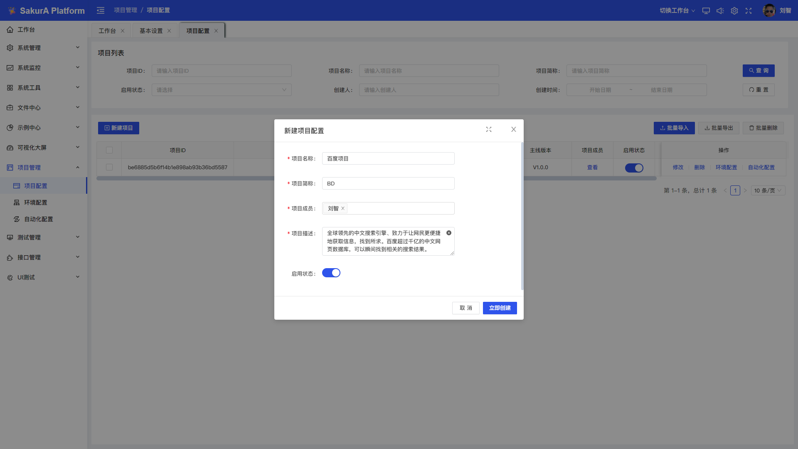
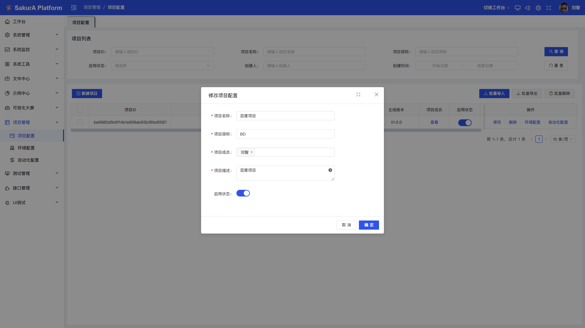
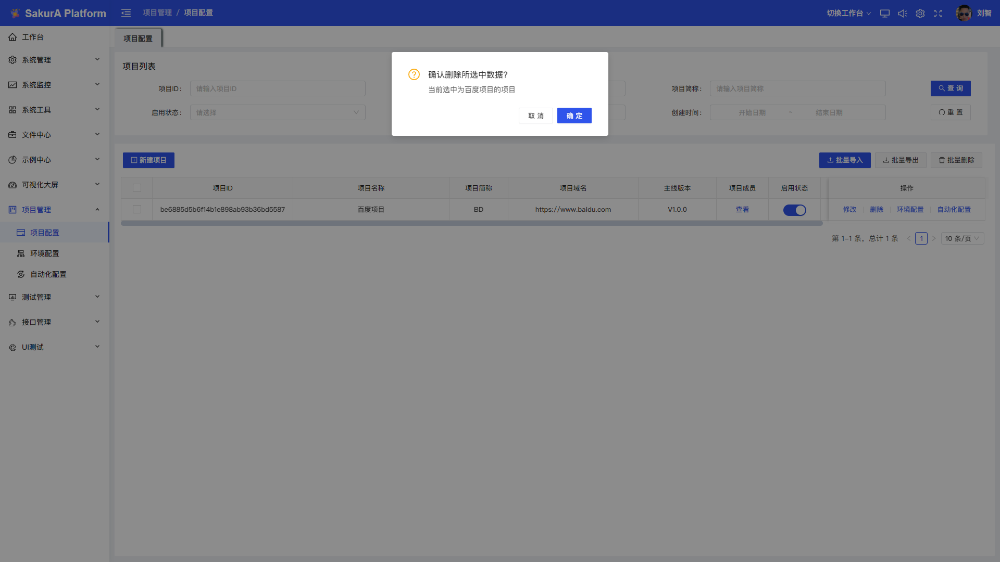
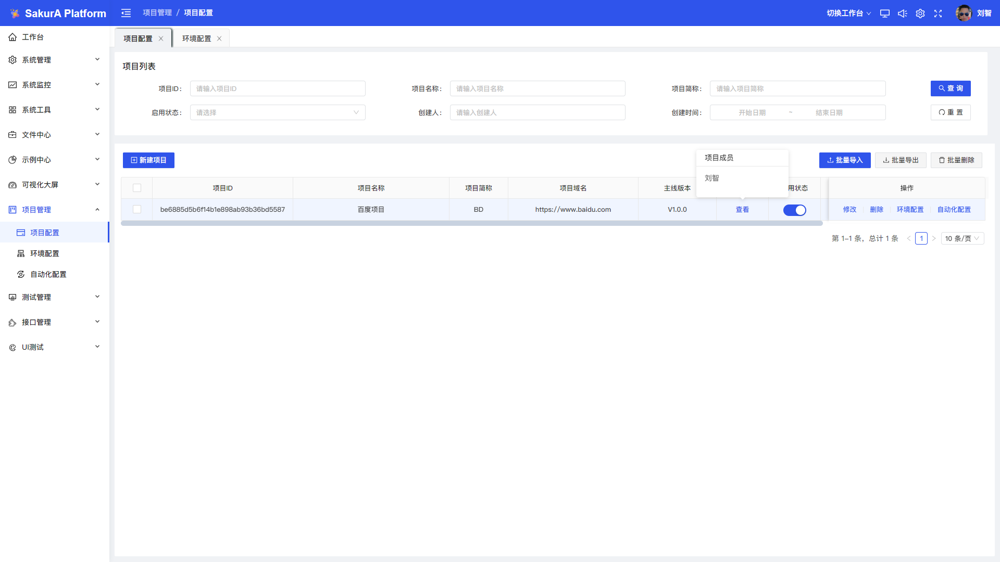

# 项目配置

## 新建项目

- 适用角色：项目组长及项目经理以上人员
- 操作步骤：进入【项目配置】，点击【新建项目】，填写对应产品项目基础信息，点击【立即创建】
  
:::tip

- 项目名称：填写对应的项目名称，例如：百度项目
- 项目简称：填写对应的项目简称，例如：BD
- 项目成员：选择对应的项目成员，例如：张三，李四
- 项目描述：填写对应的项目描述，例如：全球领先的中文搜索引擎、致力于让网民更便捷地获取信息，找到所求。百度超过千亿的中文网页数据库，可以瞬间找到相关的搜索结果。
- 项目状态：默认为启用状态即可

:::

## 修改项目

- 适用角色：项目组长及项目经理以上人员
- 操作步骤：进入【项目管理】，选择对应项目，点击【修改】，修改对应项目信息，点击【确定】

## 删除项目

- 适用角色：项目组长及项目经理以上人员
- 操作步骤：进入【项目管理】，选择对应项目，点击【删除】，点击【确定】
  
:::tip

- 主要事项：项目非必要情况下，不可乱删除，删除项目后，项目下所有数据将无法找回，请谨慎操作

:::

## 项目列表

- 适用角色：所有用户
- 操作步骤：进入【项目管理】，默认展示【项目列表】，可查看或搜索所有项目信息
  
:::tip

- 项目搜索：可输入相关项目信息进行搜索，例如：项目名称或简称等
- 批量删除：可勾选对应项目，一键进行【批量删除】操作，请谨慎操作
- 项目列表：展示所有项目信息，包括项目ID、名称、简称、域名、主线版本、成员、状态等
- 项目域名：这里的项目域名是根据对应项目环境配置-服务器配置中的域名进行展示的，默认为空
- 项目状态：项目状态分为启用和禁用，启用状态下项目可正常使用，禁用状态下项目无法使用
- 项目成员：点击蓝色查看文本，可查看对应项目成员，包括项目组长、开发人员、测试人员等
- 项目状态：项目状态分为启用和禁用，启用状态下项目可正常使用，禁用状态下项目无法使用
- 环境配置：点击【环境配置】，跳转至对应【环境配置】，可查看或搜索项目的产品环境信息
- 自动化配置：点击【自动化配置】，跳转至对应【自动化配置】，可查看或搜索项目的自动化环境信息
  
:::

