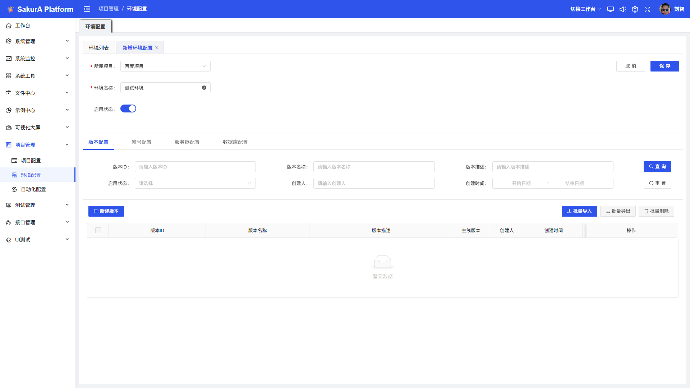
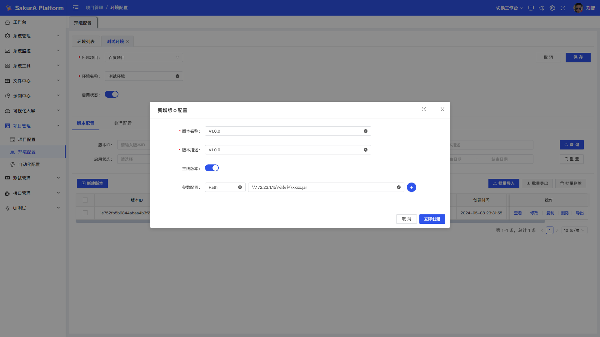
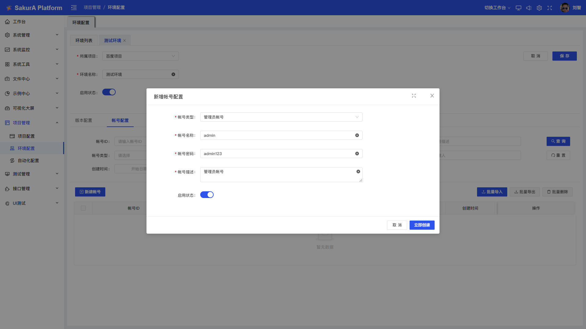
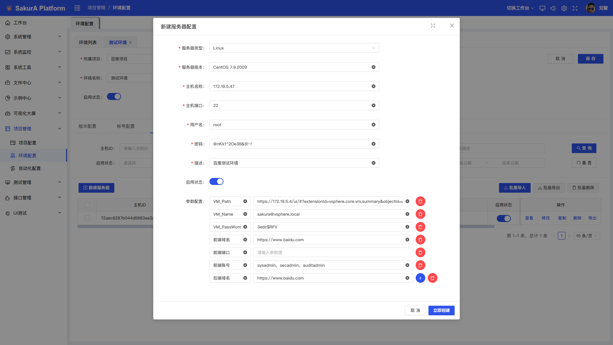
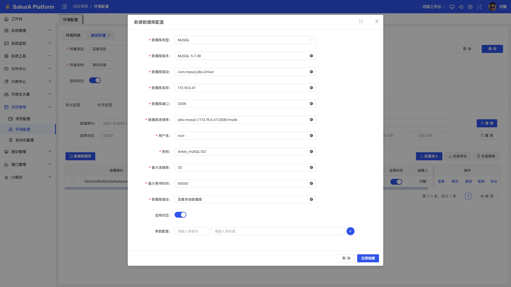

# 环境配置

## 新建环境

- 适用角色：项目组长及项目经理以上人员
- 操作步骤：进入【环境配置】，点击【新建环境】，填写对应产品项目环境基础信息，点击【保存】
  
:::tip

- 所属项目：选择对应产品项目，例如：百度项目
- 环境名称：填写对应环境名称，例如：测试环境
- 启用状态：默认为启用状态即可

:::

## 新建版本配置

- 适用角色：项目组长及项目经理以上人员
- 操作步骤：进入【环境配置-版本配置】，点击【新建版本】，填写对应版本信息，点击【立即创建】
  
:::tip

- 版本名称：填写对应版本名称，例如：V1.0.0
- 版本描述：填写对应版本描述，例如：V1.0.0版本
- 主线版本：一个环境可创建多个版本，不同版本之间可以根据主线版本启用状态进行切换
- 参数配置：主要是记录一些版本相关的参数信息，例如：安装包路径、安装包名称等

:::

## 新建帐号配置

- 适用角色：项目组长及项目经理以上人员
- 操作步骤：进入【环境配置-帐号配置】，点击【新建帐号】，填写对应帐号信息，点击【立即创建】

:::tip

- 帐号类型：选择对应帐号类型，例如：管理员帐号
- 帐号名称：填写对应帐号名称，例如：admin
- 帐号密码：填写对应帐号密码，例如：admin123
- 帐号描述：填写对应帐号描述，例如：管理员帐号
- 启用状态：默认为启用状态即可

:::

## 新建服务器配置

- 适用角色：项目组长及项目经理以上人员
- 操作步骤：进入【环境配置-服务器配置】，点击【新建服务器】，填写对应服务器信息，点击【立即创建】

:::tip

- 服务器类型：选择对应服务器类型，例如：Linux
- 服务器版本：选择对应服务器版本，例如：CentOS 7.9.2009
- 主机名称：填写对应服务器主机名称，例如：172.19.5.47
- 主机端口：选择对应服务器类型，例如：22
- 用户名：选择对应服务器类型，例如：root
- 密码：填写对应帐号名称，例如：@nKk1^2Oe38&8!~!
- 描述：填写对应帐号描述，例如：百度测试环境
- 启用状态：默认为启用状态即可
- 参数配置：主要是记录一些服务器相关的参数信息，例如：虚拟机地址，帐号密码，前端域名、端口等

:::

## 新建数据库配置

- 适用角色：项目组长及项目经理以上人员
- 操作步骤：进入【环境配置-数据库配置】，点击【新建数据库】，填写对应数据库信息，点击【立即创建】

:::tip

- 数据库类型：选择对应数据库类型，例如：MySQL
- 数据库版本：选择对应数据库版本，例如：MySQL 5.7.38
- 数据库驱动：填写对应数据库驱动，例如：com.mysql.jdbc.Driver
- 数据库名称：填写对应数据库名称，例如：172.19.5.47
- 数据库端口：填写对应数据库端口，例如：3306
- 数据库连接串：填写对应数据库连接串，例如：jdbc:mysql://172.19.5.47:3306/mydb
- 用户名：选择对应数据库用户名，例如：root
- 密码：填写对应数据库密码，例如：Ankki_mySQL123
- 最大连接数：填写对应数据库最大连接数，例如：20
- 最大等待时间：选择对应数据库最大等待时间，例如：60000
- 数据库描述：填写对应数据库描述，例如：百度本地数据库
- 启用状态：默认为启用状态即可
- 参数配置：主要是记录一些数据库相关的参数信息，例如：虚拟机地址，帐号密码等

:::

