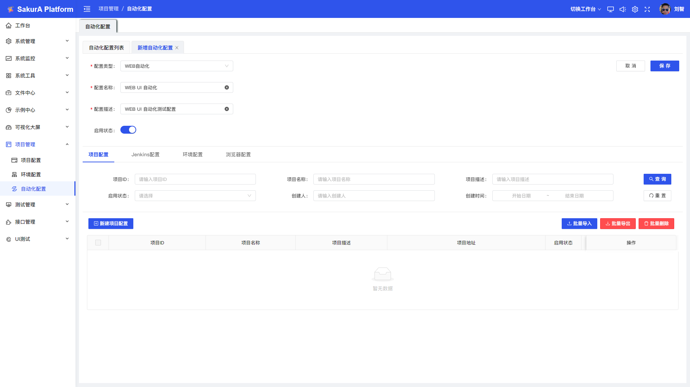
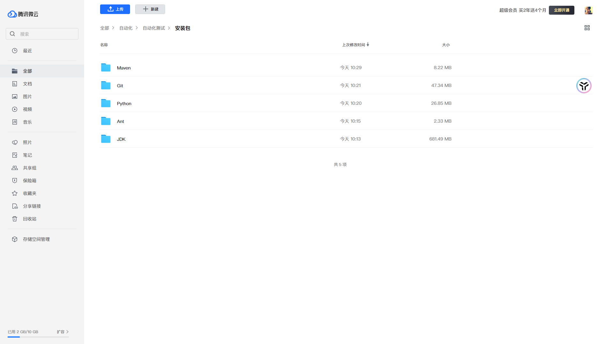
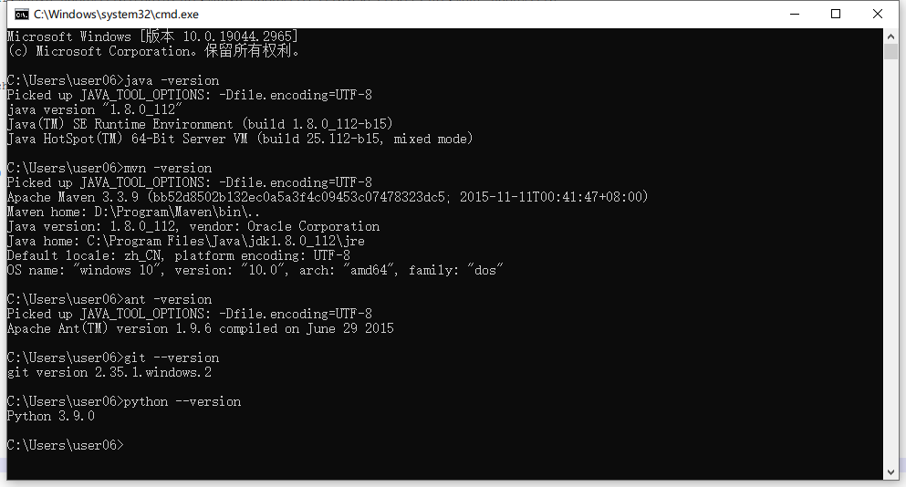
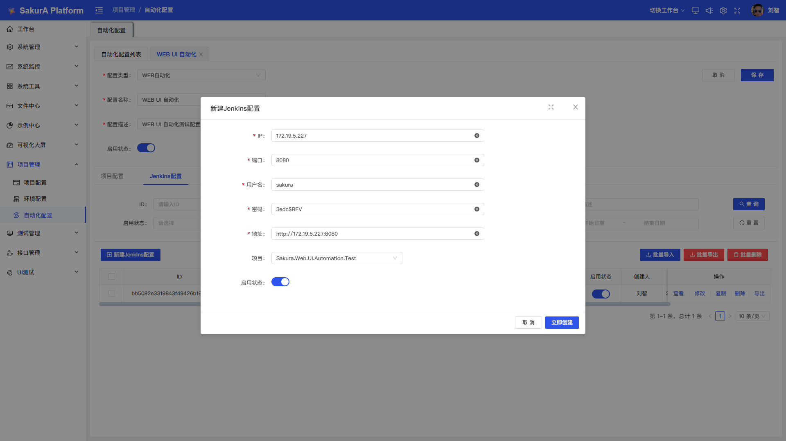
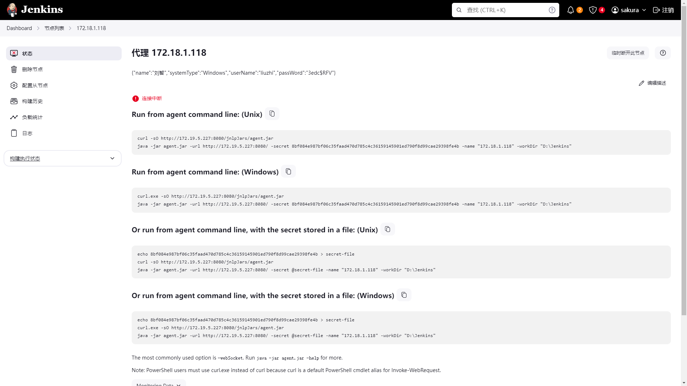
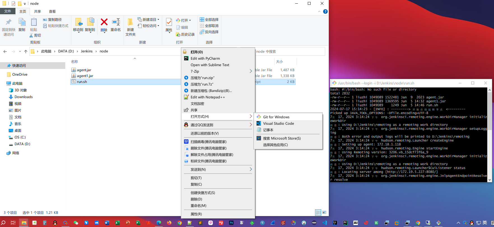
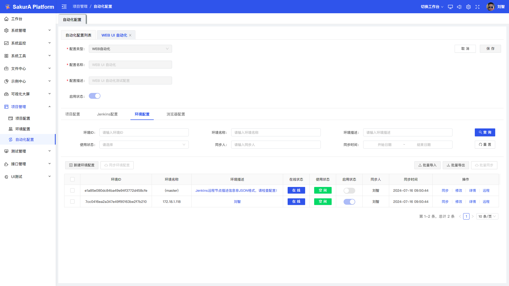
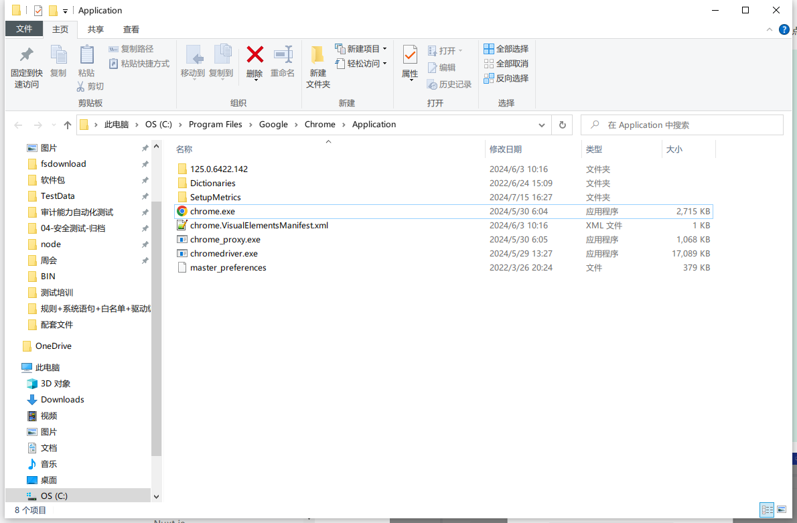
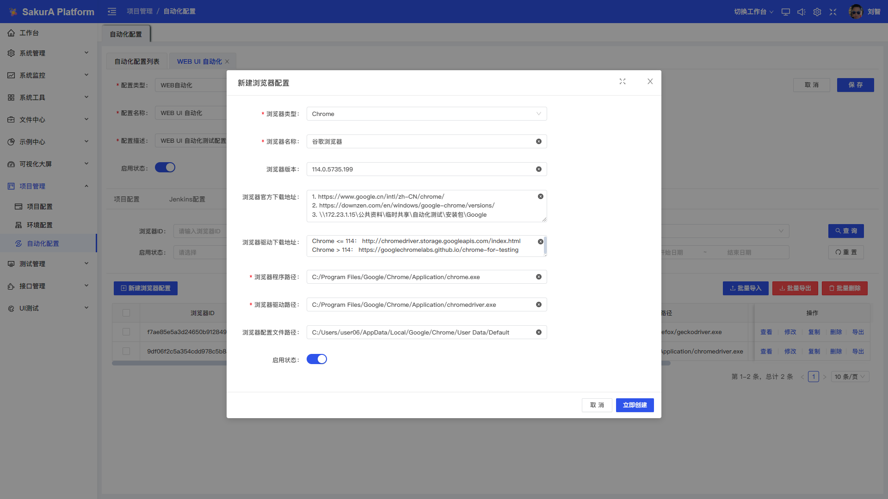

# 自动化配置

## 新建自动化配置

- 适用角色：项目组长及项目经理以上人员
- 操作步骤：进入【自动化配置】，点击【新建自动化配置】，填写对应项目自动化配置基础信息，点击【保存】
  
:::tip

- 配置类型：选择对应自动化配置类型，例如：WEB自动化
- 配置名称：填写对应自动化配置名称，例如：WEB UI 自动化
- 配置描述：填写对应自动化配置描述，例如：WEB UI 自动化测试配置
- 启用状态：默认为启用状态即可

:::



## 新建项目配置

- 适用角色：项目组长及项目经理以上人员
- 操作步骤：进入【自动化配置-项目配置】，点击【新建项目配置】，填写对应项目信息，点击【立即创建】
  
:::tip

- 项目名称：填写对应项目名称，例如：Sakura.Web.UI.Automation.Test
- 项目描述：填写对应项目描述，例如：WEB UI 自动化测试项目
- 项目地址：填写对应项目描述，例如：
  - https://gitee.com/SakuraTech/Sakura.Web.UI.Automation.Test.git
- 项目路径：作为自动化项目存储路径，例如：
  - /data/sakura/Sakura.Web.UI.Automation.Test/test/src/test/java
- 启用状态：默认为启用状态即可

:::


## Windows自动化环境搭建

> 视频安装教程
<iframe
  src="//player.bilibili.com/player.html?bvid=BV16TbzekEf6&page=1"
  scrolling="no" border="0" frameborder="no" framespacing="0" allowfullscreen="true"
  width="685" height="400"
  >
</iframe>

### 安装JDK、Maven、Ant、Git、Python

<!-- > [JDK](https://share.weiyun.com/90TRmvFg)  
> [Maven](https://share.weiyun.com/OcjaNLQN)  
> [Ant](https://share.weiyun.com/bGo9VG6N)  
> [Git](https://share.weiyun.com/m0cDcxpe)  
> [Python](https://share.weiyun.com/Cg0JGPP7) -->

> 下载地址：https://share.weiyun.com/lFNsB9Ye
:::tip

- 这里主要是通过添加本地或远程的Windows电脑自动化环境，然后作为Jenkins节点使用，操作如下：
  - 1.找一台Windows电脑，可以是本机也可以是虚拟机
  - 2.进入【D盘】，创建【Program】目录
  - 3.下载JDK，默认安装至【C:\Program Files\Java\jdk1.8.0_112】
  - 4.下载Maven，手动安装至【D:\Program\Maven】
  - 5.下载Ant，手动安装至【D:\Program\Ant\org.apache.ant_1.9.6.v201510161327】
  - 6.下载Git，手动安装至【D:\Program\Git\cmd\git.exe】
  - 7.下载Python，手动安装至【D:\Program\Python\3.9.0\python.exe】

:::



### 配置系统环境变量

:::tip

- 安装JDK、Maven、Ant、Git、Python后，需要配置系统环境变量，操作如下：
  - 1.进入【我的电脑】->【属性】->【高级系统设置】->【环境变量】
  - 2.在【系统变量】中，点击【新建】
  - 3.变量名：【JAVA_HOME】，变量值：【C:\Program Files\Java\jdk1.8.0_112】
  - 4.变量名：【CLASSPATH】，变量值：【.;%JAVA_HOME%\lib\dt.jar;%JAVA_HOME%\lib\tools.jar;%JAVA_HOME%\jre\lib\ext\jfxrt.jar;%Ant_HOME%\lib】
  - 5.变量名：【JAVA_TOOL_OPTIONS】，变量值：【-Dfile.encoding=UTF-8】
  - 6.变量名：【MAVEN_HOME】，变量值：【D:\Program\Maven】
  - 7.变量名：【ANT_HOME】，变量值：【D:\Program\Ant\org.apache.ant_1.9.6.v201510161327】
  - 8.变量名：【GIT_HOME】，变量值：【D:\Program\Git\cmd\git.exe】
  - 9.变量名：【PYTHON_HOME】，变量值：【D:\Program\Python\3.9.0】
  - 10.变量名：【Path】，追加变量值：
    - %JAVA_HOME%\bin
    - %JAVA_HOME%\jre\bin
    - %MAVEN_HOME%\bin
    - %ANT_HOME%\bin
    - %GIT_HOME%\cmd
    - %GIT_HOME%\bin
    - %PYTHON_HOME%
    - %PYTHON_HOME%\Scripts

:::


### 测试系统环境变量

:::tip

- 配置JDK、Maven、Ant、Git、Python后，需要测试系统环境变量是否生效，操作如下：
  - 1.打开【Win+R】，输入【cmd】，打开命令行窗口
  - 2.输入【java -version】，回车，有显示版本即可
  - 3.输入【mvn -version】，回车，有显示版本即可
  - 4.输入【ant -version】，回车，有显示版本即可
  - 5.输入【git --version】，回车，有显示版本即可
  - 6.输入【python --version】，回车，有显示版本即可

:::


## 新建Jenkins配置

- 适用角色：项目组长及项目经理以上人员
- 操作步骤：进入【自动化配置-Jenkins配置】，点击【新建Jenkins配置】，填写对应信息，点击【立即创建】

:::tip

- IP：选择对应Jenkins主机IP，例如：172.19.5.227
- 端口：选择对应Jenkins，例如：8080
- 名称：填写对应Jenkins用户名，例如：sakura
- 密码：填写对应Jenkins密码，例如：3edc$RFV
- 地址：填写对应Jenkins地址，例如：http://172.19.5.227:8080
- 项目：选择对应Jenkins项目，例如：Sakura.Web.UI.Automation.Test
- 启用状态：默认为启用状态即可

:::



## 新建环境配置

### 添加Jenkins节点

- 适用角色：项目组长及项目经理以上人员
- 操作步骤：进入【自动化配置-环境配置】，点击【新建环境配置】，填写对应节点信息，点击【Create】
- 操作描述：这里主要是把本地或远程的Windows电脑环境当做自动化环境，通过Jenkins远程控制

:::tip

添加节点：

- 节点名称：填写对应Windows自动化环境IP地址，通过ipconfig查看IPv4地址，例如：172.18.1.119
- Type：可勾选复制现有节点，输入对应节点名称搜索选择，例如：172.18.1.118
  
配置节点：

- 名称：填写对应节点名称，例如：172.18.1.118（注意不要重复）
- 描述：填写对应节点描述，例如：
  - {"name":"刘智","systemType":"Windows","userName":"liuzhi","passWord":"3edc$RFV"}
  - 这里根据以上示例修改对应内容即可，例如：远程电脑用户名，系统类型，账号密码等
- 远程工作目录：填写对应远程工作目录，例如：D:\Jenkins
- 工具位置：注意对应工具位置为对应Windows远程节点上本地的安装目录，例如：
  - JDK: C:\Program Files\Java\jdk1.8.0_112
  - Maven：D:\Program\Maven
  - Ant：D:\Program\Ant\org.apache.ant_1.9.6.v201510161327
  - Python：D:\Program\Python\3.9.0\python.exe
  - Git：D:\Program\Git\cmd\git.exe
- 其它默认即可

:::


### 启动Jenkins节点

:::tip

- 添加节点成功后，Jenkins会自动生成远程连接脚本，Windows主要使用第二排的脚本，如下：

:::


:::tip

- 创建启动脚本，修改对应内容，启动即可，操作如下：
  - 1. 进入对应远程节点目录，一般是【D:\Jenkins】，新建【node】目录
  - 2. 快捷键Win+R，输入【cmd】，再输入【D:&&cd D:\Jenkins\node】回车
  - 3. 执行命令下载agent.jar文件，命令从Jenkins生成的脚本中复制，如下：
    - 【curl.exe -sO http://172.19.5.227:8080/jnlpJars/agent.jar】
  - 4. 关闭cmd窗口，右键新建一个【run.sh】文件，复制粘贴下面shell脚本保存
  - 5. 修改其中的启动命令，命令从Jenkins生成的脚本中复制，如下：
    - 【java -jar agent.jar -url http://172.19.5.227:8080/ -secret 8bf084e987bf06c35faad470d785c4c36159145901ed790f8d99cae29398fe4bx -name "172.18.1.118" -workDir "D:\Jenkins"】
  - 6. 启动【run.sh】脚本，即可远程控制对应Windows节点
  - 7. 启动成功后，Jenkins会自动同步对应节点信息

:::

```bash
#!/bin/bash

#---FUNCTION-----------------------------------------------------------------------------------------------------------
#   NAME:  启动脚本
#   DESCRIPTION:  脚本入口函数
#----------------------------------------------------------------------------------------------------------------------

function __echo_info() {
  echo "`date +'%F %T'` - [INFO] : $*"
}

run() {
  ls -l
  export os_type="Win"
  _echo_info "---------> 开始启动远程节点 <---------"

  if [[ "${os_type}" == "Win" ]]; then
    # 新版本的jenkins需要使用jdk11启动，不然会报错
    # 下载JDK11【https://share.weiyun.com/lFNsB9Ye】，安装至【C:/Program Files/Java/jdk-11.0.15】
    # 这里的命令根据从Jenkins生成的脚本中替换即可
    "C:/Program Files/Java/jdk-11.0.15/bin/java" -jar agent.jar -url http://172.19.5.227:8080/ -secret 8bf084e987bf06c35faad470d785c4c36159145901ed790f8d99cae29398fe4bx -name "172.18.1.118" -workDir "D:\Jenkins"
  fi

  __echo_info "---------> 启动远程节点结束 <---------"
}

run || exit 1
```




### 同步Jenkins节点

:::tip

- 注意事项：每次进入环境配置页面，都会自动同步Jenkins上的节点环境，也可以手动同步或修改

:::


## 安装浏览器 & 浏览器驱动

:::tip

- 这里主要是安装Chrome浏览器和驱动，注意驱动版本需要与浏览器版本对应，操作如下：
  - 1.下载[chrome](https://www.google.cn/intl/zh-CN/chrome/)，默认安装至【C:/Program Files/Google/Chrome/Application】
  - 2.下载[chromedriver](https://googlechromelabs.github.io/chrome-for-testing)，手动解压至【C:/Program Files/Google/Chrome/Application】

:::


## 新建浏览器配置

- 适用角色：项目组长及项目经理以上人员
- 操作步骤：进入【自动化配置-浏览器配置】，点击【新建浏览器配置】，填写对应浏览器信息，点击【确定】

:::tip

- 浏览器类型：选择对应浏览器类型，例如：Chrome
- 浏览器名称：填写对应浏览器名称，例如：谷歌浏览器
- 浏览器版本：填写对应浏览器版本，例如：114.0.5735.199
- 浏览器官方下载地址：填写对应浏览器官方下载地址，例如：
  - https://www.google.cn/intl/zh-CN/chrome/
  - https://downzen.com/en/windows/google-chrome/versions/
- 浏览器驱动下载地址：填写对应浏览器驱动下载地址，例如：
  - Chrome <= 114： http://chromedriver.storage.googleapis.com/index.html
  - Chrome > 114： https://googlechromelabs.github.io/chrome-for-testing
- 浏览器程序路径：填写对应浏览器程序路径，例如：
  - C:/Program Files/Google/Chrome/Application/chrome.exe
- 浏览器驱动路径：选择对应浏览器驱动路径，例如：
  - C:/Program Files/Google/Chrome/Application/chromedriver.exe
- 浏览器配置文件路径：填写对应浏览器配置文件路径，例如：
  - C:/Users/user06/AppData/Local/Google/Chrome/User Data/Default
- 启用状态：默认为启用状态即可

:::



